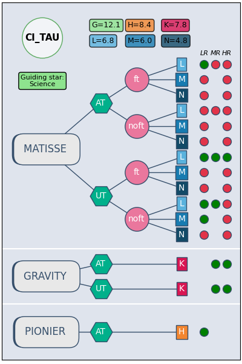
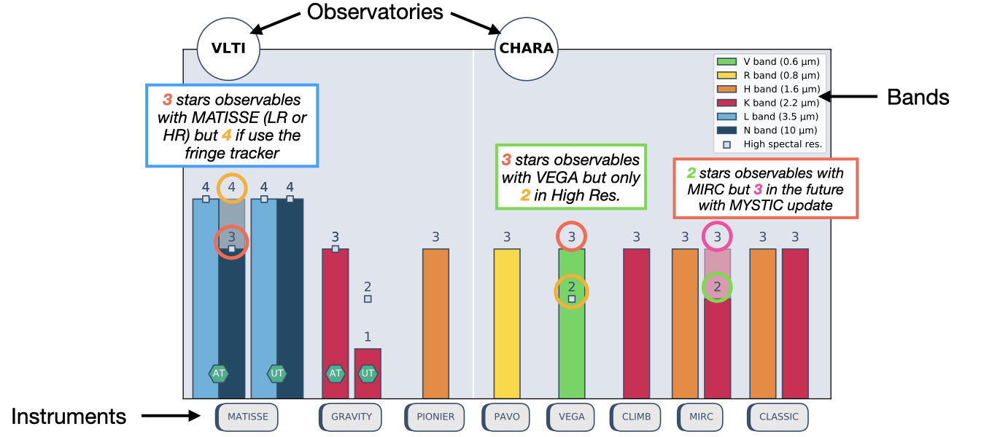

# PREVIS

(**P**ython **R**equest **E**ngine for **V**irtual **I**nterferometric **S**urvey)

[](https://github.com/DrSoulain/PREVIS/)
[](http://www.astropy.org/)

PREVIS is a Python module that provides functions to help determine the observability of astronomical sources
in a few lines of code.
One can perform a single object search (`previs.search`) or a multiple-objects search (`previs.survey`).
These functions use data from the Virtual Observatory (OV), such as:

- Spectral Energy Distribution (SED) from [Vizier](http://vizier.u-strasbg.fr/vizier/sed/).
- Magnitudes: visible (V, R, G), near-infrared (J, H, K) and mid-infrared (L, M, N). The SED is used to extract the missing magnitudes of [Simbad](http://simbad.u-strasbg.fr/simbad/).
  Especially L (3.5 µm), M (4.5 µm), and N (10 µm) magnitudes which are not often included in the standard catalogs,
- Spectral type,
- Celestial coordinates,
- Gaia DR2 informations (if available).

PREVIS compares the magnitudes to the current limiting magnitudes of each instruments to determine whether
the target is observable with current performances. The actual instruments are installed at:

- The european Very Large Telescope Interferometer ([VLTI](https://www.eso.org/sci/facilities/paranal/telescopes/vlti.html))
  with [PIONIER](https://www.eso.org/sci/facilities/paranal/instruments/pionier.html) (H band), [GRAVITY](https://www.eso.org/sci/facilities/paranal/instruments/gravity.html) (K band) and [MATISSE](https://www.eso.org/sci/facilities/paranal/instruments/matisse.html) (L, M, N bands),
- The american Center for Hight Angular Resolution Astronomy ([CHARA](http://www.chara.gsu.edu)), with
  [VEGA](http://www.chara.gsu.edu/instrumentation/vega) (V band), [PAVO](http://www.chara.gsu.edu/instrumentation/pavo) (R bands), [MIRC](http://www.chara.gsu.edu/instrumentation/mirc) (H band), [CLIMB](http://www.chara.gsu.edu/instrumentation/classic-and-climb) (K band) and [CLASSIC](http://www.chara.gsu.edu/instrumentation/classic-and-climb) (H, K bands).

PREVIS also uses the V or G magnitudes to check the guiding issues or the tip/tilt correction limit.
For the VLTI: if the star is too faint in G mag, PREVIS will look for the list of stars around
the target (57 arcsec) with the appropriate magnitude and give the list of celestial coordinates
usable as guiding star. Of course, PREVIS checks also the on-site observability given the latitude of both observatories.

## What can PREVIS do for you?

An example script [example.py](example.py) is included to test the possibilities offered by PREVIS. The example includes a single target
research using `previs.search`, a visualisation solution for the VLTI (`previs.plot_VLTI`) and CHARA (`previs.plot_CHARA`).
The example also presents the survey capabilities of the module.

For instance, if you use `previs.search` to fetch data about the star Altair, you can display the resulting observability with the VLTI instruments with `previs.plot_VLTI`:

<p align="center">

</p>

Such a graph represents multiple informations:

- *Upper left*: the name of the target with a green cirle if the star is observable from the VLTI, red if not,
- *Upper right*: appropriate magnitudes for the VLTI instruments,
- The round square at the bottom of the target indicate the information of the guiding star:
  - 'Science': the target is bright enought to be used as guiding star, 
  - 'off axis': the coudé off-axis guiding need to be used,
  - 'off axis*', the coudé off-axis guiding can only be performed in visitor mode.
- The organigram of each instrument:
  - The blue/green octogone indicate the telescope (UT (8m) or AT (1.8m)),
  - The pink circle indicate if fringe tracker (GRA4MAT) is used (ft) or not (noft),
  - The colored squares indicates the observing bands (same color as magnitudes),
  - The right circles are green if the target is observable for each spectral resolution (low (LR), medium (MR) or high (HR)), red if not.

Now, if you use `previs.survey` on a list of 5 stars for instance, you can display the histogram of the result using `previs.plot_histo_survey`:

<p align="center">

</p>

In this case, you can see that the stars are not observable with all instruments and depend of the considered mode. For instance, 3 stars are observables with MATISSE in low spectral resolution with the AT in N band (dark blue bar). The grey squares indicate the number of stars observable in high spectral resolution:

- with MATISSE:
  - 3 in N-band and 4 in L-band with the AT,
  - 4 in N-band and 4 in L-band with the UT.
- with GRAVITY:
  - 3 with the AT,
  - 2 with the UT.

The background bars for MATISSE and MIRC indicate respectively, the fringe tracker possibility (GRA4MAT) and the future update MYSTIC operating in K-band. In this case, 3 stars are observable with MATISSE in N-band but 4 if you use the fringe tracker (see ft/noft of `previs.search` result and [plot_VLTI](doc/figure_1.png) figure).

## Install from source (for conda-based systems)

It is recommended (though not mandatory) to create a separate environment with `conda create -n <env_name>`.
Then, within your Conda env (`conda activate <env_name>`):

```bash
cd PREVIS/

# Install main dependencies
conda install --file requirements.txt

# Some dependencies are not in the general Conda channel,
# so we specify the desired channels
conda install -c astropy astroquery
conda install -c conda-forge uncertainties

# Finally, install PREVIS
pip install .
```
