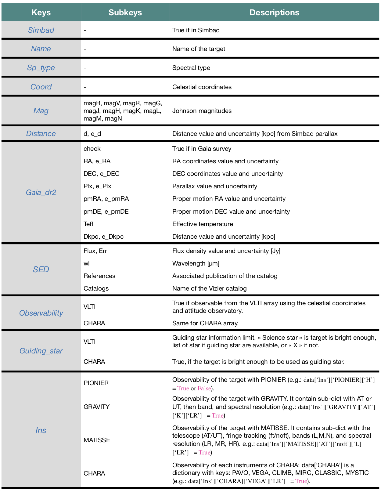

# PREVIS's public api reference

## Core functions

`previs.search`: This function is the core of previs, it use the Virtual Observatory (VO) to get multiple informations about a star (see [tab.1](description_all_keys_previs.jpg)). The star magnitudes are compared to the limiting magnitudes of each HRA instruments to determine if the target is observable. Previs check also the general observing limitations as guiding performance and tip/tilt correction using V, R or G magnitudes. See `previs.search` docstring for a detailed explanation of the additional arguments.

The output of previs.search and associated keys are presented below:

`previs.survey`: This function perform the `previs.search` on a list of stars.

## Saving/loading results from previous runs

Results from `previs.search` or `previs.survey` can be exported to, and read back from json.

`previs.save`: Save the results of `previs.search/survey` to an easely accessible json file. The survey process can take a long time (between 10 and 30s for each stars), do not forget to save the survey results if your sample is large.

`previs.load`: Load the json file containing a previous survey or data saved with `previs.save_survey`.

## Plotting functions

These functions are used to present a synthetic resume of the `previs.search` or `previs.survey` results. The first application of previs is to know quickly the observability of a star, so the following functions will often be used to display the results of previs.

`previs.plot_VLTI`: Fonction to plot the observability of a star with each instruments installed at the VLTI array. The structure of the figure is discussed in the [README.md](README.md) file. **Tips**: a green point/circle indicate that your star in ready to be observed.

`previs.plot_CHARA`: Same as `previs.plot_VLTI` for the american interferometer CHARA.

`previs.plot_histo_survey`: Fonction to present the results from `previs.survey` as an histogram. All implimented instruments are included (from VLTI and CHARA). An example is presented in the [README.md](../README.md). In this function, you can add the argument plot_HR = True to add the high spectral resolution results on the plot as grey square (see. [desc_survey_example.jpeg](desc_survey_example.jpeg)). You also can set_log = True, to plot the y-axis scale in log (appropriate for large survey).
